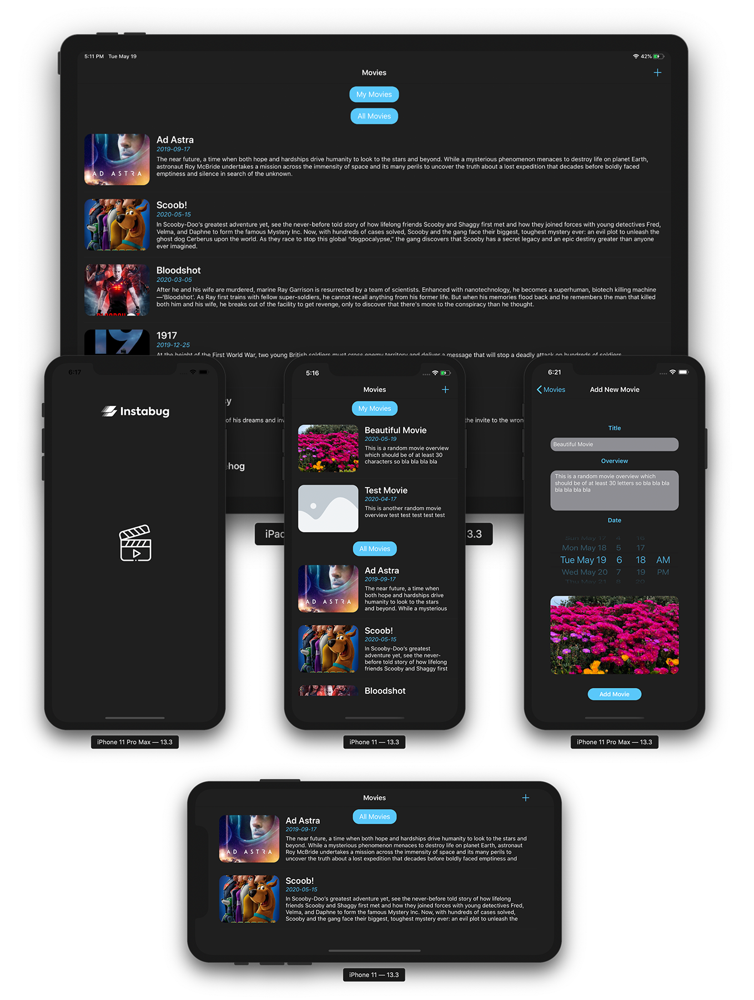
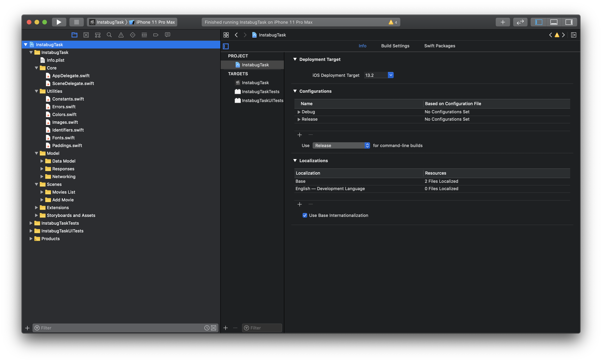
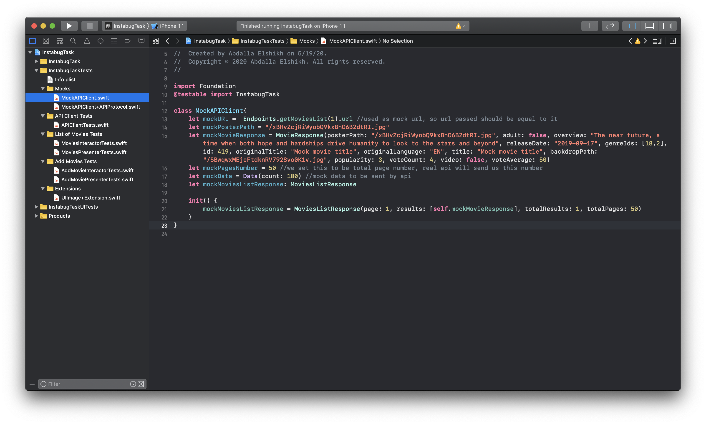
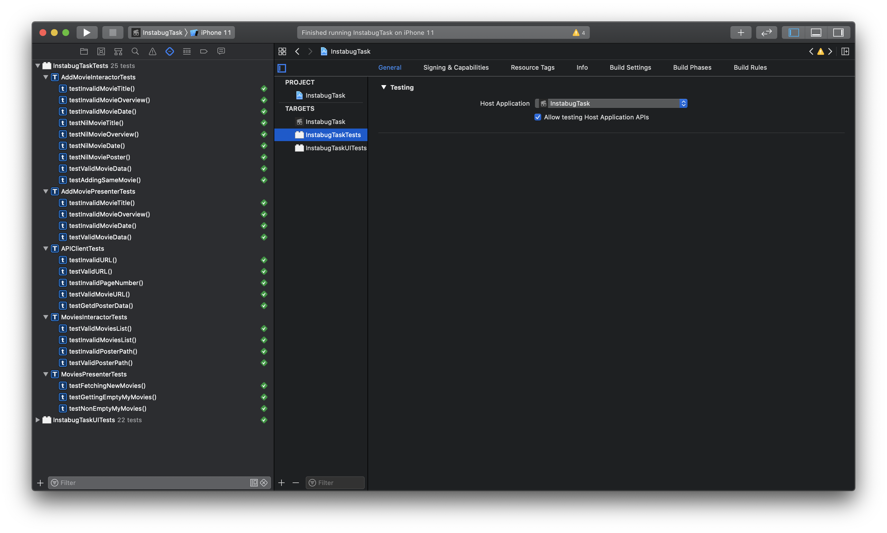

# <b> Instabug iOS Internship Task </b>
An application that displays to users TMDB Discover List's Movies and gives users the ability to Add new movies to their application. The application was developed for Instabug Internship task.

  

## <b> Code Design and Architecture </b>
This application is developed using the MVP Design Pattern which was chosen over other Design Patterns as MVC and MVVM in order to avoid having massive view controllers and also make the code more maintainable and testable.

  

- <b>Model</b>: 
  * The Data Model and the networking code are encapsulated inside the model. 
  * The users movies "My Movies" are stored in a singleton shared instance that contains all the user added movies which makes it accessible to all presenters.
  * The networking code consists of Response Codable Structs and API Client which makes calls to TMDB API to fetch movies list.
- <b>View</b>:
  * In this architecture the view conrollers are considered part of the view as they are "Dumb" and not aware of any logic happening behind the scene as this is the job of the view controller's presenter which helps in making view objects more reusable.
  * The first scene which displays the list of fetched movies consists of a table view with custom cells which are implemented in MoviesTableViewCell file. The table view has 2 sections, the first one is "My Movies" section which contains movies added by the user and the second section is "Add Movies" section which contains movies fetched from the TMDB API
  * The second scene which gives user ability to add new movies is simple which consists of a Text Field for entering Movie Title, a Text view for entering the Movie Overview, A Date Picker which allows picking release date of movie, an Image view which when pressed gives user the ability to pick an Image from the Photo Library and a button that allows for confirming adding the movie.
- <b>Presenters</b>: This application has 2 scenes, the Movies list scene and the Add movies scene, each of which has its own presenter
  * The Movies List Presenter handles all presentation logic and provides view controller with instructions for what should be displayed and notifies it when new movies are available to reload table view. This presenter has its own interactor.
    - <b>Movies List Interactor:</b> The interactor handles extra logic as making network calls for fetching new movies and fetching poster images for each movie. The process starts by fetching the title, date, overview and poster path of all the movies which are displayed on the table view, after that, a network call is made to fetch the poster of each new fetched movie. This is better than fetching each movie with its poster before fetching other movies because if the network is weak users would be able to read the movies description while the poster of each movie is loaded.
  * The Add Movies Presenter: handles all presentation logic and provides view controller with instructions for when an alert should be displayed. This presenter also has its own Interactor.
    - <b>Add Movies Ineractor:</b> The interactor handles validation checking to make sure that movie data entered is valid (Movie title should be at least 3 characters and Movie overview should be at least 30 characters). It's also responsible for checking if the added movie already exists to avoid adding multiple entries of the same movie.

## <b> Unit Tests </b>
- For the Unit tests, I have created a Mock API Client to be able to mock the behaviour of the API without needing to connect to the server. The unit Tests test the networking code for making API calls

  

- These Unit Tests also test the behaviour of both presenters and interactors of the 2 scenes.
- I tried to cover as much Unit Tests as I could and there are a total of 25 Unit Tests that cover different application units functionalities.

  

   
